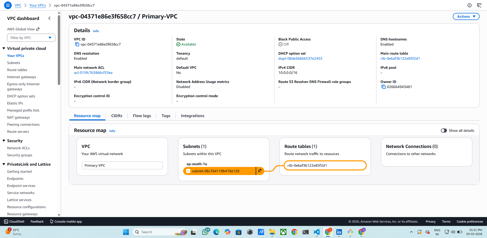
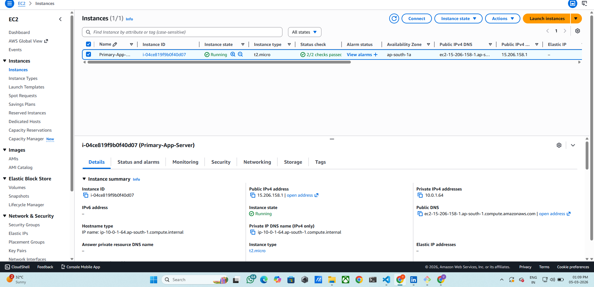
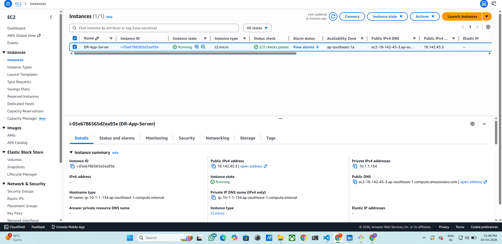
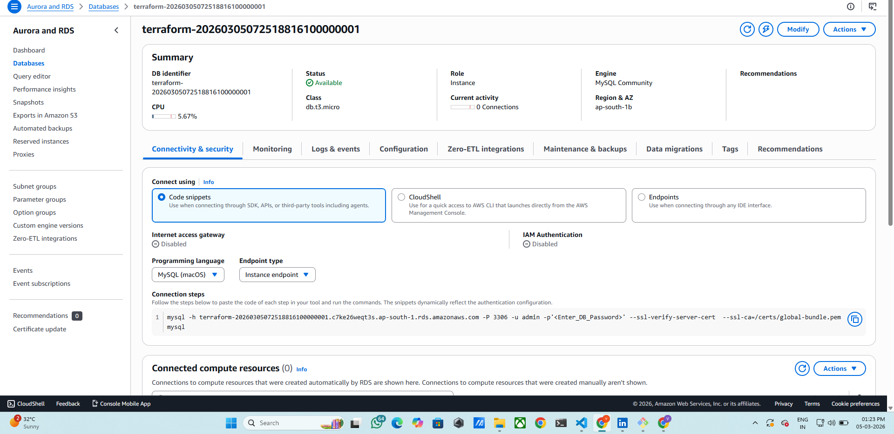
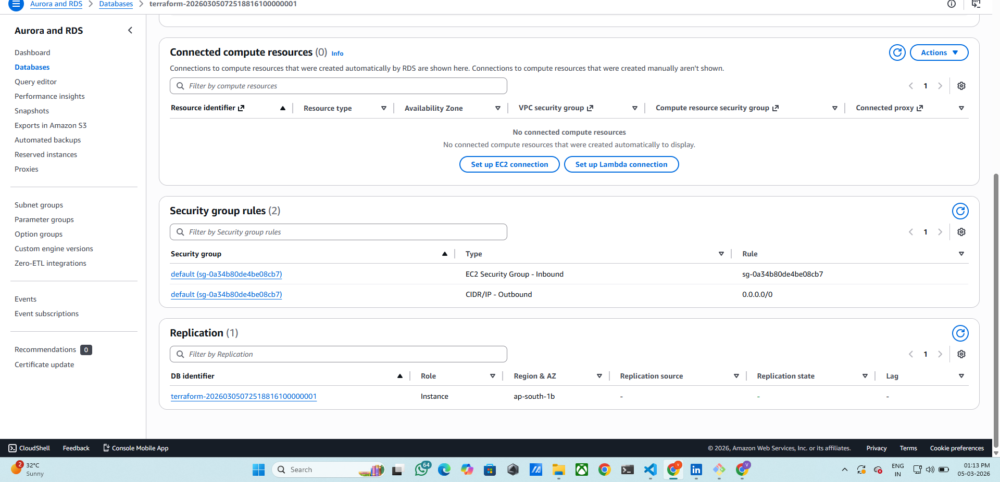
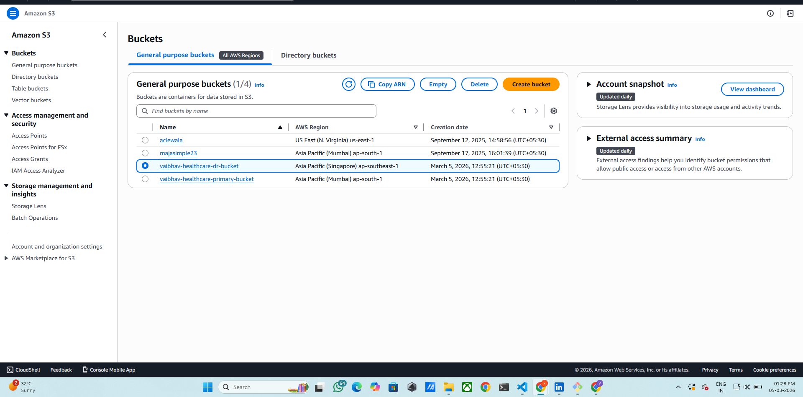
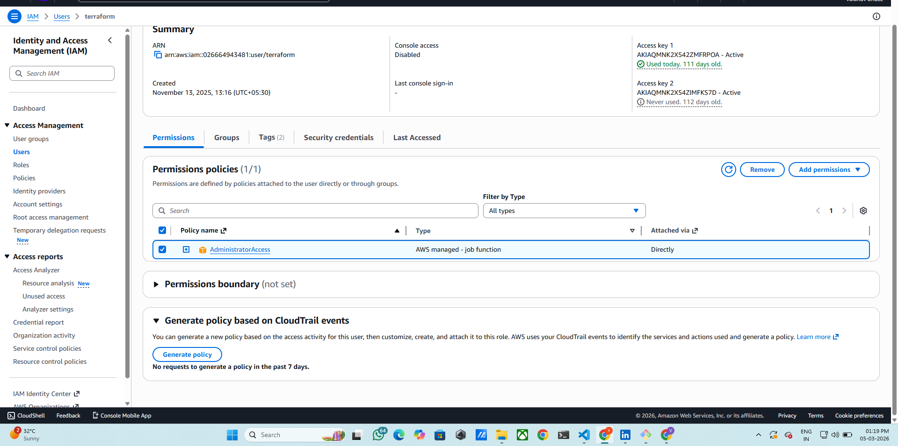
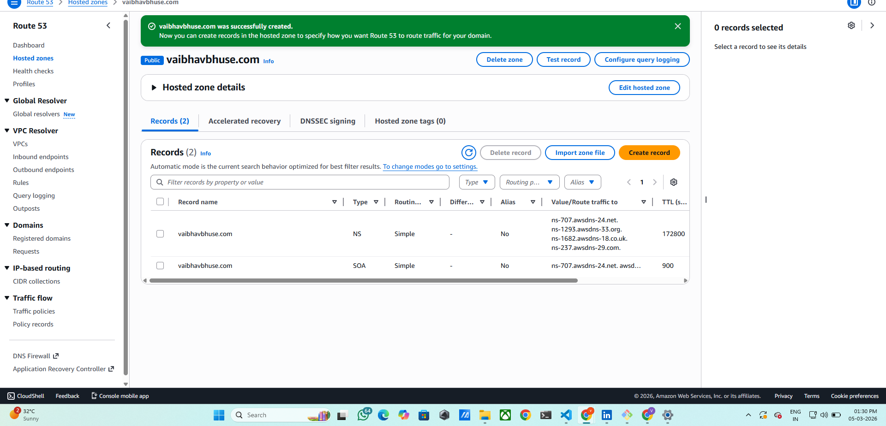

🚀 Disaster Recovery Architecture with Cross-Region Replication & Automated Failover (AWS)

📌 Project Overview
This project demonstrates a Production-Grade Disaster Recovery Architecture on AWS designed to maintain high availability, fault tolerance, and business continuity.
The infrastructure is deployed across multiple AWS regions. If the primary region fails, the system automatically redirects traffic to a Disaster Recovery (DR) environment using DNS failover.
The architecture implements cross-region replication, automated failover, and backup strategies to minimize downtime and prevent data loss.

🏗 Architecture Components
🌐 Networking
Primary VPC
Disaster Recovery VPC
Each region contains an isolated Virtual Private Cloud for hosting application infrastructure.

🖥 Compute Layer
Primary Application Server (EC2)
Disaster Recovery Application Server (EC2)
The DR server acts as a standby application server that becomes active during failure scenarios.

🗄 Database Layer
Primary Database (Amazon RDS)
Cross-Region Read Replica
The database is replicated from the primary region to the DR region to ensure data availability.

📦 Storage Layer
Amazon S3 Bucket
Cross-Region Replication (CRR)
Critical application data stored in S3 is replicated automatically to a secondary region.

🌍 DNS & Failover
Route 53 Failover Routing Policy
Route 53 continuously monitors the health of the primary application and automatically switches traffic to the DR environment if the primary environment becomes unavailable.

🔐 Security
IAM Roles and Policies
Secure access control is implemented using AWS Identity and Access Management.

📊 Architecture Flow
1️⃣ Users access the application through Route 53 DNS.

2️⃣ Traffic is directed to the Primary EC2 Application Server.

3️⃣ The application interacts with the Primary RDS Database.

4️⃣ RDS replicates data to a Cross-Region Read Replica in the DR region.

5️⃣ S3 buckets replicate data using Cross-Region Replication.

6️⃣ Route 53 continuously performs health checks on the primary environment.

🚨 Failure Scenario
If the primary region becomes unavailable:

Route 53 detects the failure.

DNS traffic automatically switches to the DR EC2 instance.

The RDS Read Replica can be promoted as the primary database.

🧩 AWS Services Used
Service

Purpose

EC2

Application hosting

RDS

Managed relational database

S3

Object storage and backup

Route 53

DNS failover routing

VPC

Network isolation

IAM

Secure access control

🖼 Project Screenshots
Primary VPC

screenshots/primary-vpc.png

screenshots/dr-vpc.png
Primary EC2 Instance

screenshots/primary-ec2.png
DR EC2 Instance

screenshots/dr-ec2.png
RDS Database

screenshots/rds.png
Database Replication

screenshots/db-replication.png
S3 Bucket

screenshots/s3-bucket.png
IAM Configuration

screenshots/iam.png
Route 53 Failover Setup

⚙ Deployment Steps
Step 1
Create Primary VPC in the primary region.

Step 2
Launch Primary EC2 Application Server.

Step 3
Create Amazon RDS Database.

Step 4
Configure Cross-Region Read Replica.

Step 5
Create Disaster Recovery VPC in secondary region.

Step 6
Launch DR EC2 Instance.

Step 7
Enable S3 Cross-Region Replication.

Step 8
Configure Route 53 Failover Routing Policy.

Step 9
Create IAM roles and policies for secure access.

🎯 Key Features
✅ High Availability

✅ Cross-Region Database Replication

✅ Automated DNS Failover

✅ Disaster Recovery Ready Infrastructure

✅ Secure IAM Configuration

✅ Fault-Tolerant Architecture

📚 Learning Outcomes
Designing Disaster Recovery architectures on AWS

Implementing Cross-Region Replication

Configuring Route 53 Failover

Building Highly Available Cloud Infrastructure

Managing AWS services for production-grade resilience

👨‍💻 Author
Prathmesh Pawar
Aspiring AWS & DevOps Engineer